# Inko — Exhaustive Flow Charts — Every Actor, Service, State & Error Branch
**Version:** 3.0 — Redo Exhaustive 2026-08-29 20:00 IST (Every little thing)
**Date:** 2026-08-29 20:00 IST — Redone per phases
**Source:** `backend/src/**` (124 files), `frontend/src/**` (1952 modules), `db/migration V1-V12`, `SecurityConfig`, `App.tsx`, `*.tsx pages`, `PrintCalc`, `TokenService`, `OrderService`, `PaymentService`, `PricingService`
**Format:** Mermaid `flowchart TD` + `sequenceDiagram` + `stateDiagram-v2` — paste any block into [mermaid.live](https://mermaid.live) or VS Code `Markdown Preview Mermaid`

---

## Legend — How To Read
- `([ ])` = entry/exit terminal
- `{ }` = decision / guard
- `[ ]` = process / API call / UI component
- `[( )]` = DB / poster / external
- `A -->|label| B` = transition with HTTP / event
- Colors: `Guest #fef3c7`, `Customer #dbeafe`, `Shop #fef9c3`, `Admin #ede9fe`, `Error #fee2e2`
- All HTTP routes prefixed `/api` unless noted; `permitAll` = no JWT required

---

## 1. Whole App — Infrastructure & System Overview (All Actors + Services + DB)

```mermaid
flowchart TD
    Poster[("📮 QR Poster<br/>code_value UNIQUE 64<br/>status ACTIVE|REPLACED|EXPIRED<br/>shop_id FK")]
    Browser["Browser SPA<br/>http://localhost:5173<br/>Vite + React Router"]
    Frontend["Frontend React Shell<br/>App.tsx 100L<br/>AuthProvider + SettingsProvider<br/>AreaGuard customer|shop|admin<br/>CustomerShell / ShopShell / AdminShell"]
    AuthAPI["Auth API<br/>/api/auth/guest<br/>/api/auth/register|login|refresh|logout<br/>/api/auth/otp/request|verify<br/>/api/auth/forgot-password<br/>JWT access 15m / refresh 7d<br/>BCrypt 10 / OTP SHA256 5m 5 attempts"]
    ShopAPI["Shop API<br/>GET /api/shops permitAll<br/>GET /api/shops/:id permitAll<br/>GET /api/shops/mine auth SHOPKEEPER<br/>POST /api/shops auth SHOPKEEPER<br/>PATCH /api/shops/:id owner<br/>DELETE /api/shops/:id BCrypt<br/>GET /api/shops/:id/qr/scans owner"]
    DocAPI["Document API<br/>POST /api/documents/upload<br/>FormData files*10 ≤50MB<br/>ext pdf/jpg/png/doc/ppt/xls/txt<br/>analyze pageCount blankPages<br/>GET /api/documents auth"]
    PricingAPI["Pricing API<br/>POST /api/pricing/quote auth?<br/>SHOP rule override PLATFORM<br/>inputs shopId paperSize colorMode sidesMode selectedPageCount copies coupon<br/>→ PriceBreakdown sheets/printedPages<br/>GET /api/pricing/rules owner-checked<br/>POST/PUT/DELETE rules shop/admin"]
    OrderAPI["Order API<br/>POST /api/orders → INKO-YYYY-######<br/>GET /api/orders mine<br/>GET /api/orders/:id auth+ownership<br/>GET /api/orders/shop/:id (shop/admin)<br/>POST /api/orders/:id/status"]
    PaymentAPI["Payment API<br/>POST /api/orders/:id/payment<br/>method MOCK_UPI|COD<br/>idempotencyKey UNIQUE<br/>providerOrderRef<br/>POST /api/payments/:id/verify<br/>GET /api/orders/:id/payment<br/>POST /api/orders/:id/refund REQUESTED"]
    TokenAPI["Token API<br/>POST /api/tokens<br/>GET /api/shops/:id/queue<br/>POST /api/tokens/:id/transition<br/>GET /api/tokens/:id<br/>GET /api/tokens/:id/wait<br/>GENERATED→WAITING→CALLED→PRINTING→COMPLETED<br/>priority 10/20/100/200"]
    QueueEntryDB[("QueueEntry<br/>queue_entries<br/>token_id UNIQUE<br/>shop_id position queuedAt<br/>status WAITING|CALLED|PRINTING|COMPLETED")]
    QueueSSE["SSE Stream<br/>GET /api/shops/:id/queue/stream 60s<br/>SseEmitter CopyOnWriteArray<br/>event token / connected"]
    InventoryAPI["Inventory API<br/>GET /api/catalog/inventory<br/>PUT /api/catalog/inventory<br/>paperSize gsm quantity lowStockThreshold"]
    QrAPI["QR API<br/>GET /api/qr/:code/resolve permitAll<br/>POST /api/qr/:code/scan permitAll<br/>POST /api/shops/:id/qr/regenerate owner<br/>GET /api/shops/:id/qr/history"]
    AnalyticsAPI["Analytics API<br/>GET /api/analytics/overview?shopId scoped<br/>GET /api/analytics/series?days&shopId<br/>GET /api/analytics/mix<br/>GET /api/analytics/revenue"]
    AdminAPI["Admin API<br/>GET /api/admin/users?size100<br/>PATCH /api/admin/users/:id/roles<br/>PATCH /api/admin/users/:id/status<br/>GET /api/admin/audit page25<br/>GET+PATCH /api/complaints<br/>POST /api/refunds/:id/decision"]
    NotifyAPI["Notification API<br/>GET /api/notifications<br/>GET /api/notifications/unread-count<br/>POST /api/notifications/:id/read<br/>poll 30s + SSE"]
    ComplaintAPI["Complaint API<br/>POST /api/complaints<br/>9 categories WRONG_PRINT..OTHER"]
    DB[("PostgreSQL 17<br/>28 tables V1-V12<br/>users/roles/perms/shop/printers<br/>documents/order_items/pricing_rules<br/>payments/refunds/tokens/queue_entries<br/>qr_codes/qr_scan_events/inventory<br/>notifications/audit_logs/system_settings")]
    Storage[("File Storage<br/>backend/data/storage<br/>disk fallback")]
    Poster -->|scan /qr/:code| Browser
    Browser --> Frontend
    Frontend -->|GET /qr/:code/resolve 200 shopId<br/>POST /qr/:code/scan log ip/ua| QrAPI
    Frontend -->|POST /auth/guest 201 guest@guest<br/>POST /auth/register 201<br/>POST /auth/login + OTP<br/>POST /auth/refresh single-flight| AuthAPI
    Frontend -->|POST /documents/upload FormData<br/>progress onUploadProgress<br/>GET /documents| DocAPI
    Frontend -->|POST /pricing/quote<br/>shopId paperSize color sides selectedPageCount copies coupon| PricingAPI
    Frontend -->|POST /api/orders<br/>GET /orders /history<br/>GET /orders/shop/:id| OrderAPI
    Frontend -->|POST /orders/:id/payment MOCK_UPI|COD<br/>idempotencyKey<br/>POST /payments/:id/verify| PaymentAPI
    PaymentAPI -->|PAID→tokens.generate A001 WAITING<br/>idempotent by orderId| TokenAPI
    PaymentAPI -->|COD_SELECTED→generate WAITING| TokenAPI
    TokenAPI -->|WAITING→CALLED→PRINTING→COMPLETED<br/>synced queue_entries| QueueEntryDB
    TokenAPI -->|PRINTING once<br/>sheets=ceil(printedPages/1or2)<br/>deduct inventory paperSize-matched<br/>LOW_STOCK threshold cross only| InventoryAPI
    TokenAPI -->|TOKEN_CALLED/PRINTING/COMPLETED| NotifyAPI
    TokenAPI -->|order QUEUED→PRINTING→COMPLETED<br/>or FAILED| OrderAPI
    Frontend -->|GET /shops/:id/queue poll2500/5000<br/>GET /tokens/:id/wait<br/>EventSource SSE 60s| QueueSSE
    QueueSSE -->|broadcast token DTO| Frontend
    Frontend -->|GET /analytics/overview?shopId<br/>GET /series?days 1/7/30/365| AnalyticsAPI
    Frontend -->|GET /admin/users|audit<br/>PATCH roles/status<br/>GET /complaints PATCH<br/>POST /refunds/:id/decision| AdminAPI
    Frontend -->|POST /complaints OPEN| ComplaintAPI
    Frontend -->|GET /notifications<br/>POST /read| NotifyAPI
    Frontend -->|GET /shops/mine PUT /inventory<br/>POST qr/regenerate<br/>GET /net/lan-ip| ShopAPI
    DocAPI & ShopAPI & PricingAPI & OrderAPI & PaymentAPI & TokenAPI & QueueEntryDB & InventoryAPI & QrAPI & AnalyticsAPI & AdminAPI & NotifyAPI & ComplaintAPI --> DB
    DocAPI --> Storage
    style Poster fill:#ede9fe,stroke:#7c3aed
    style Frontend fill:#dbeafe,stroke:#2563eb
    style DB fill:#fef3c7,stroke:#d97706
    style PaymentAPI fill:#dcfce7,stroke:#16a34a
    style TokenAPI fill:#fef9c3,stroke:#ca8a04
```

**End-to-end happy sequence:** `QR ACTIVE poster → Browser /qr/:code → resolve 200 → scan log → localStorage inko.qrShop → guest mint (ephemeral CUSTOMER JWT) → Upload FormData → analyze pageCount → Configure select shop/paper/BW-COLOR/SINGLE-DOUBLE/pages ALL or 1-5,8/copies/coupon → POST /pricing/quote (SHOP>PLATFORM, decompose, best discount, tax, minOrder) → YOU PAY ₹final → POST /orders INKO-YYYY-###### CREATED (PrintConfiguration + OrderItem per doc, totalPages=Σ printedPages, snapshot sheets) → POST /orders/:id/payment MOCK_UPI idempotencyKey → CREATED→CONFIGURED→PAYMENT_PENDING auto → provider createCheckout → POST /payments/:id/verify → PAID → Order PAID → tokens.generate A%03d priority NORMAL100 → Token GENERATED→WAITING + QueueEntry WAITING → notify TOKEN_ISSUED → Customer Queue /queue/:shopId SSE live → Shop QueueManage poll+SSE → WAITING→CALLED (calledAt) → notify Your turn → auto 2s → PRINTING (startedAt, inventory -sheets once, low-stock check paperSize-matched, notify Printing started, Order QUEUED→PRINTING) → COMPLETED (completedAt, QueueEntry COMPLETED, Order COMPLETED, notify Print completed) → History GET /orders search → Print again /configure?reprint with shop/docs preserved → Shop Pricing/Inventory/QR → Admin Users/Orders/Complaints/Audit overview`

---

## 2. State Machines — Single Source Of Truth

### 2.1 Order Status (OrderStatus.java)

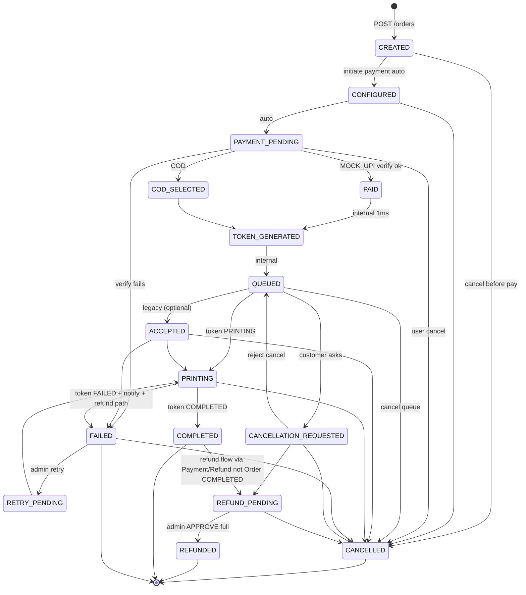

**Rule:** Never use `COMPLETED` for FAILED/CANCELLED. Frontend stepper `stepIndex`: 0 PLACED, 1 PAYMENT, 2 QUEUED, 3 PRINTING, 4 COMPLETED. Badge tones: success COMPLETED, danger CANCELLED/FAILED, brand PAID/QUEUED.

### 2.2 Token Status (TokenStatus.java) — Strict Validation

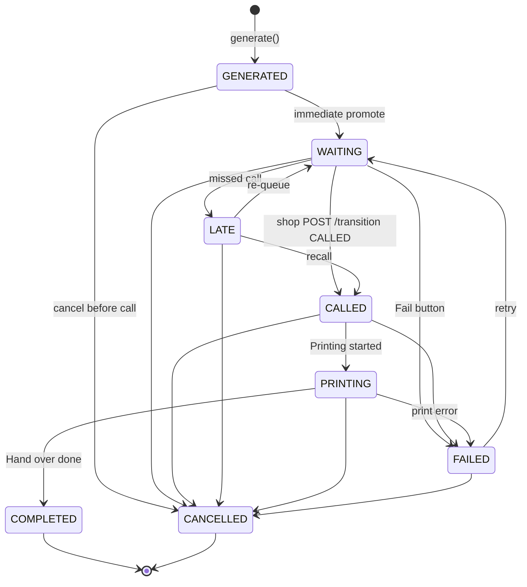

**Invalid rejected 400:** `WAITING→COMPLETED`, `COMPLETED→PRINTING`, `COMPLETED→CALLED`, `CANCELLED→any`, `GENERATED→PRINTING`. Backend `Token.canTransitionTo` enforced; frontend `NEXT_ACTION` only shows valid target per status.

### 2.3 QueueEntry Status (queue_entries table) — Aligned To Token
- `WAITING` ↔ Token WAITING (in queue)
- `CALLED` ↔ Token CALLED (called to counter)
- `PRINTING` ↔ Token PRINTING (on printer)
- `COMPLETED` ↔ Token COMPLETED (done to collect) — *was DONE legacy, now standardized*
- `CANCELLED` / `FAILED` ↔ Token CANCELLED/FAILED → removed from active queue `findQueue WAITING|CALLED|PRINTING` only
- **Idempotency:** `token_id UNIQUE` prevents 1 order → 1 token → 1 queueEntry duplicate.

### 2.4 Payment / Refund Separation

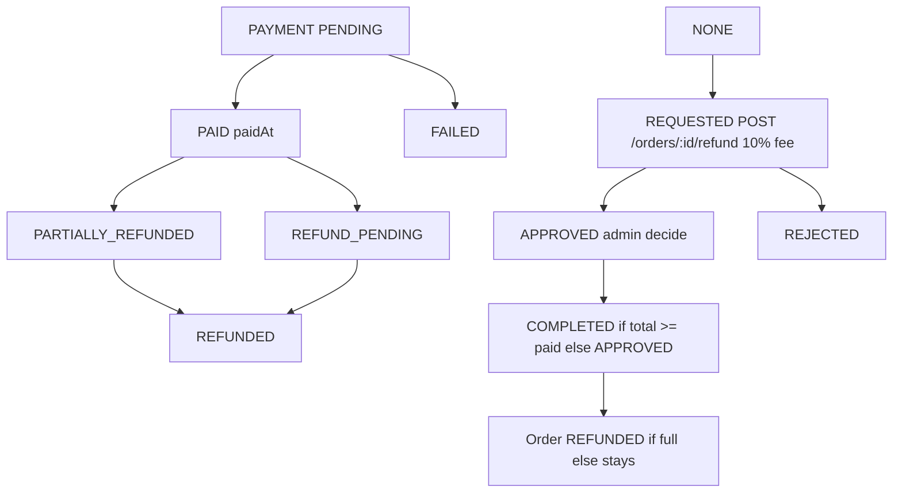

Order status ≠ Payment status ≠ Refund status kept separate; `Order COMPLETED` never means `Refund COMPLETED`.

---

## 3. Guest via QR (Unauthenticated → Ephemeral CUSTOMER)

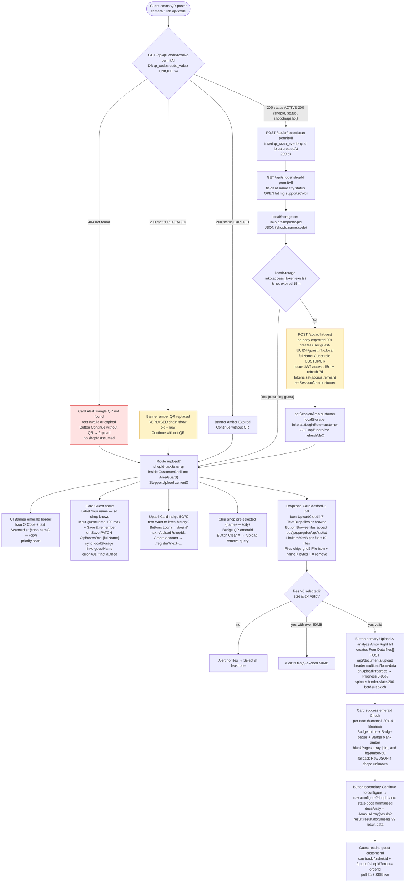

**Auth details:** `POST /auth/guest` idempotent? No — creates new guest each call; frontend guards with `guestTried` flag + `tokens.access` check to mint once.

---

## 4. Customer (ROLE_CUSTOMER — Registered / Logged In)

```mermaid
flowchart TD
    CStart([Customer lands /login<br/>Welcome unified AreaHome logic]) --> Tabs{"UI Tabs Sign in | Create account<br/>Cards Customer FileText vs Shop Store"}
    Tabs -->|Create account click| RegCust["Form Register Customer<br/>Inputs fullName 1-120 required<br/>Email @Email xor Phone +?[0-9]{8,15} + fullPhone<br/>Country Select +91 default<br/>Password 8-72 + confirm match live<br/>strength bar width len*12% color weak→strong<br/>AccountType hidden CUSTOMER"]
    RegCust --> ValidateReg{valid?}
    ValidateReg -- no --> ErrReg["Field errors red<br/>confirm mismatch, email invalid"]
    ValidateReg -- yes --> POSTReg["POST /api/auth/register<br/>body {fullName,email,phone,password,accountType CUSTOMER}<br/>409 Duplicate if email/phone exists<br/>hash BCrypt 10, insert users + user_roles CUSTOMER<br/>201 AuthResponse {accessToken 15m, refreshToken 7d, user}"] --> AuthRespCust["Client tokens.set + setSessionArea customer<br/>GET /users/me → user.roles [CUSTOMER]<br/>localStorage lastLoginRole=customer"]
    Tabs -->|Sign in| Methods{"Toggle method Password / Phone OTP"}
    Methods -- Password --> LoginPwd["Form Sign in<br/>Input identifier Mail lowerTrim<br/>Input password Lock eye<br/>Link Forgot? → /forgot-password<br/>Button primary Sign in ArrowRight"]
    LoginPwd --> POSTLogin["POST /api/auth/login<br/>{identifier,password}<br/>findByEmailOrPhone case-insensitive<br/>BCrypt verify + requireActive status ACTIVE<br/>update lastLoginAt now<br/>issue JWT + refresh<br/>200 AuthResponse"] --> AuthRespCust
    LoginPwd -- 401 --> ErrLogin["Alert 401 INVALID_CREDENTIALS<br/>clear password"]
    RegCust -- 409 --> ErrDup["Alert 409 Already exists<br/>link to sign in"]
    Methods -- OTP --> SendOTP["Form OTP<br/>Select country +91 + Input phone<br/>Button Send OTP"] --> POSTOtpReq["POST /api/auth/otp/request<br/>{identifier phone}<br/>generate 6-digit SHA256 random<br/>insert otp_codes expires 5m attempts 0 consumed null<br/>devMode 200 {delivered, devCode}"] --> DevCode["Alert info indigo devCode mono<br/>pass to Verify"] --> VerifyOTP["Input otp 6 boxes mono<br/>Button Verify"] --> POSTVerify["POST /api/auth/otp/verify<br/>{identifier,code}<br/>check expires + attempts<5 + hash match<br/>if ok mark consumedAt now<br/>issue AuthResponse"] --> AuthRespCust
    POSTVerify -- fail --> ErrOTP["Alert wrong code / expired / 5 attempts exceeded"]
    AuthRespCust --> DashCust["Route /customer/dashboard<br/>AreaGuard customer + CustomerShell header<br/>Hero Welcome back 👋 Hello {fullName}<br/>Stats Cards: Shops online count GET /shops filter OPEN/BUSY<br/>Your orders count GET /orders<br/>Shops grid cards Store icon + name city + Badge OPEN success/BUSY warning + Button Open shop"]
    DashCust --> UploadC["Route /upload<br/>Stepper Upload current0<br/>fromQr Banner if ?shopId&src=qr<br/>Guest name card + Upsell if guest<br/>Dropzone dashed → File chips<br/>Button Upload & analyze → POST /documents/upload<br/>Result Cards per doc pages mime blank<br/>Button Continue to configure"]
    UploadC --> ConfigC["Route /configure?shopId&reprint?<br/>Stepper Configure current1<br/>Props docs[] from location.state<br/>State shops GET /shops list<br/>shopId useState qrShopId? locked: select<br/>QR locked Card emerald QrCode + {shop name} + Badge QR<br/>else Select shop dropdown + p city status<br/>Print options Card:<br/>Paper A4/A3/A5/LETTER/LEGAL Select<br/>Color BW COLOR Select<br/>Sides SINGLE DOUBLE Select<br/>Copies Input 1-100<br/>Pages Input ALL placeholder tip 1-5,8<br/>Coupon Input uppercase TAG + Apply Button secondary"]
    ConfigC --> CountPages["JS countPages(sel,total) mirrors PrintCalc<br/>if ALL → total<br/>else split , sum range 1-5 →5 etc<br/>parsedPages = countPages(pages, doc.pages|pageCount|5)"]
    CountPages --> Quote["SideEffect 600ms debounce<br/>POST /api/pricing/quote  body {shopId,paperSize,colorMode,sidesMode,pages:parsedPages,copies,specialPaper false,couponCode upper?<br/>Shop override PLATFORM resolve<br/>sheetsPerCopy DOUBLE?(pages+1)/2:pages<br/>sheets=sheetsPerCopy*copies<br/>printedPages=pages*copies<br/>subtotal=unitPrice*printedPages<br/>specialCharge spc*sheets if any<br/>decompose 50/50<br/>best discount → afterDiscount<br/>tax = after*taxPercent/100<br/>final = after+tax clamp minOrderAmount<br/>→ PriceBreakdown {unitPrice pages copies sheets printedPages subtotal paper/color/side/special discount tax final currency ruleId}"] --> QuoteUI["UI YOU PAY ₹final emerald<br/>text For {pages}×{copies} incl taxes<br/>Breakdown Card paper/color/side/special/discount/tax/Final<br/>Confirm button Yes print ArrowRight"]
    Quote -- error 400 pages<=0 --> ErrQuote["Alert ValidationFailed pages>0"]
    Quote -- error 404 pricing not configured --> ErrPricing["Alert No pricing for A4/BW/SINGLE"]
    Quote -- coupon invalid --> ErrCoupon["Alert Invalid coupon 400"]
    QuoteUI --> CreateOrd["Button Confirm & print<br/>check docIds.length + shopId<br/>build payload {shopId,couponCode,items:[{documentId,paperSize,colorMode,sidesMode,orientation AUTO,pageSelection pages,copies}] xN}<br/>POST /api/orders<br/>backend validate shop exists & OPEN else 400<br/>per doc parse selPages, quote, sum totalPages, subtotal,discount,tax,final<br/>insert Order INKO-YYYY-###### status CREATED + configs + items (itemSubtotal per item = bd.finalAmount)<br/>201 Order"] --> Detail["Route /order/:id poll 3s<br/>Card Header Order mono + Badge status brand|success + ₹final<br/>Stepper timeline PLACED→PAYMENT→QUEUED→PRINTING→COMPLETED<br/>Live Token Badge WAITING/Called/Printing/Completed + estimate<br/>Items list documents + copies/pages<br/>Pricing snapshot json<br/>Payment Card + Refund/Complaint"]
    Detail --> Pay{"Pay decision<br/>order.status check"}
    Pay -- status not CREATED/CONFIGURED/PAYMENT_PENDING --> PayDone["Banner emerald Payment already {status}<br/>track queue instead<br/>hide Pay buttons"]
    Pay -- MOCK_UPI --> Initiate["POST /api/orders/:id/payment {MOCK_UPI idempotencyKey uuid}<br/>auto CREATED→CONFIGURED→PAYMENT_PENDING<br/>if idempotencyKey repeat return existing<br/>if payment for order exists return existing<br/>insert payment PENDING provider MOCK providerOrderRef checkout"] --> Verify["POST /api/payments/:id/verify {}<br/>provider verify true → payment PAID paidAt + notify PAYMENT_CONFIRMED<br/>idempotent if already PAID skip<br/>order PAYMENT_PENDING→PAID via transition<br/>if already QUEUED skip token dup<br/>→ token A001 WAITING + notify TOKEN_ISSUED<br/> else  if verify false → payment FAILED + order PAYMENT_PENDING→FAILED"] --> QueueC["Route /queue/:shopId?order=<br/>Header Queue live badge SSE emerald Live Radio vs Polling amber 2500ms<br/>Mine Card 5xl tokenNumber + Badge WAITING|CALLED|PRINTING|COMPLETED + Position + estimate<br/>Waiting list priority+issuedAt + At a glance"]
    Pay -- COD --> CODP["POST /api/orders/:id/payment {COD}<br/>same auto transitions<br/>insert payment PAID immediately<br/>order COD_SELECTED → token WAITING idempotent<br/>no verify needed"] --> QueueC
    Detail --> RefundBtn["UI Button Request refund 10% fee<br/>show if status PAID|COD_SELECTED|TOKEN_GENERATED|QUEUED|PRINTING and no REQUESTED refund<br/>POST /orders/:id/refund {reason}<br/>200 Refund REQUESTED net=gross-10%"] --> RefundList["List refunds Badge REQUESTED→APPROVED→COMPLETED<br/>admin Approve/Reject via /refunds/:id/decision"] --> AdminDecideA["Admin decides APPROVED→COMPLETED?"] 
    Detail --> Complaint["Button File complaint Dialog<br/>Select category 9 WRONG_PRINT..OTHER<br/>Textarea description<br/>POST /api/complaints {orderId,shopId,category,description} → OPEN<br/>admin resolves PATCH"]
    QueueC --> HistoryC["Route /history<br/>GET /api/orders mine<br/>Controls Search orderNumber/status + Status Select + Shop Select<br/>Table mono8 Order | Status Badge | Shop | Date Clock3 | Amount ₹<br/>Desktop table + Mobile cards<br/>Button Print again → /configure?reprint=&shopId state docs+originalItems"]
    HistoryC --> ProfileC["Route /customer/profile<br/>avatar 16 + Badge brand + list Mail/Phone/ShopId<br/>Button Open settings + Sign out POST /auth/logout → /login<br/>DangerZone red Trash2 → Dialog input password → DELETE /api/users/me → INACTIVE deleted-{id}"]
    ProfileC --> SettingsC["Route /customer/settings<br/>4 rows Bell notifications + Volume2 sound + Moon darkMode + Globe language en-IN hi mr<br/>switches persist localStorage inko.settings + speech Test voice"]
    SettingsC --> BellC["Component NotificationsBell h9 w9 badge red<br/>GET /notifications refetch30s + GET unread-count<br/>speak newest if sound true<br/>Dropdown list read/unread"]
    LoginPwd -- 401 --> ErrLogin
    RegCust -- 409 --> ErrDup
    Pay -- 409 Already exists --> ErrPay["Alert Conflict Payment already exists → return existing not error idempotent"]
```

---

## 5. Shopkeeper (ROLE_SHOPKEEPER — Owner of shops.owner_user_id, accountType SHOP_OWNER → role SHOPKEEPER + CUSTOMER)

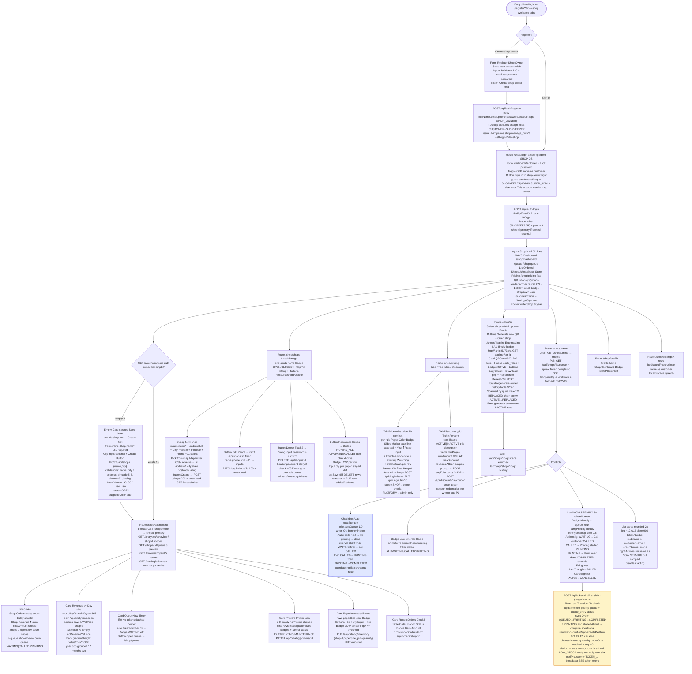

---

## 6. Admin / Super Admin (ROLE_ADMIN | SUPER_ADMIN — Governance Hierarchy)

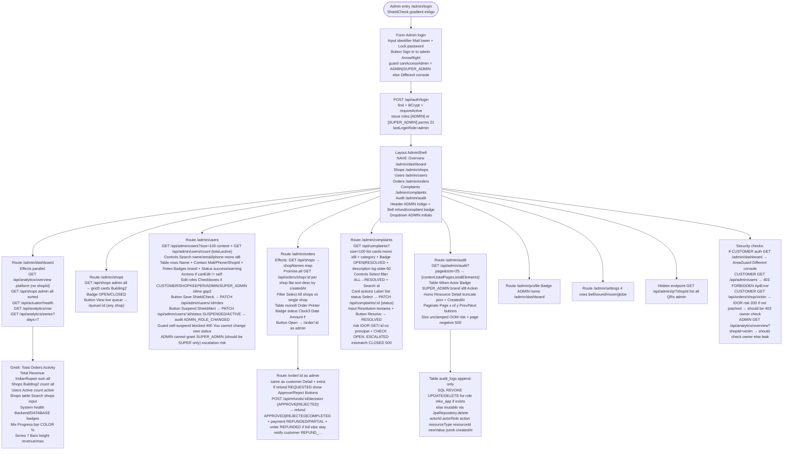

**Hierarchy Note:**
```
ADMIN: view/manage users (not SUPER), manage orders, complaints, refunds, analytics overview/mix/series, audit read
SUPER_ADMIN: same as ADMIN + manage admin roles (grant ADMIN), system config, high governance, suspend peers
Guard: self-edit blocked, should be SUPER only can grant SUPER/ suspend ADMIN
```

---

## 7. Sequence — Order → Payment → Token → Queue (Cross-Actor Core with Idempotency)

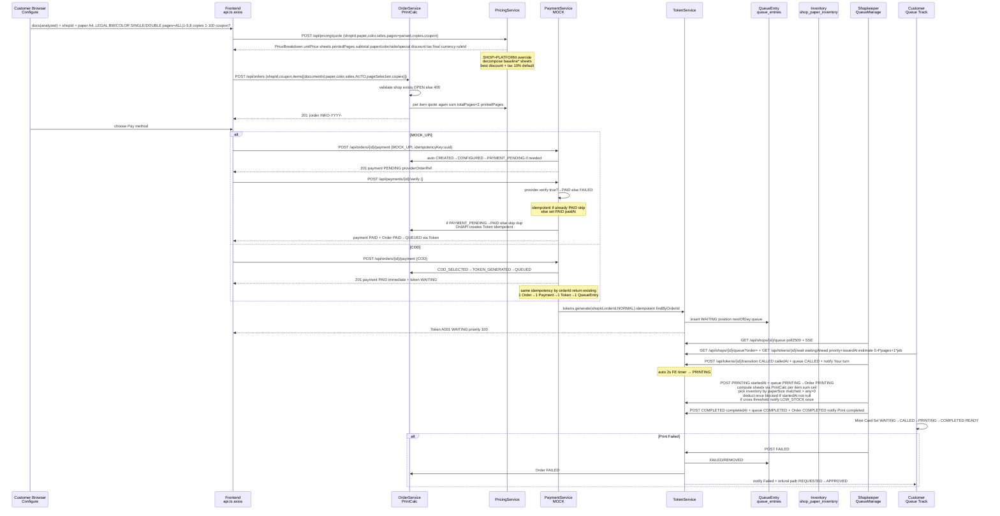

---

## 8. Auth & RBAC — Guest, Register, Login (All Variants)

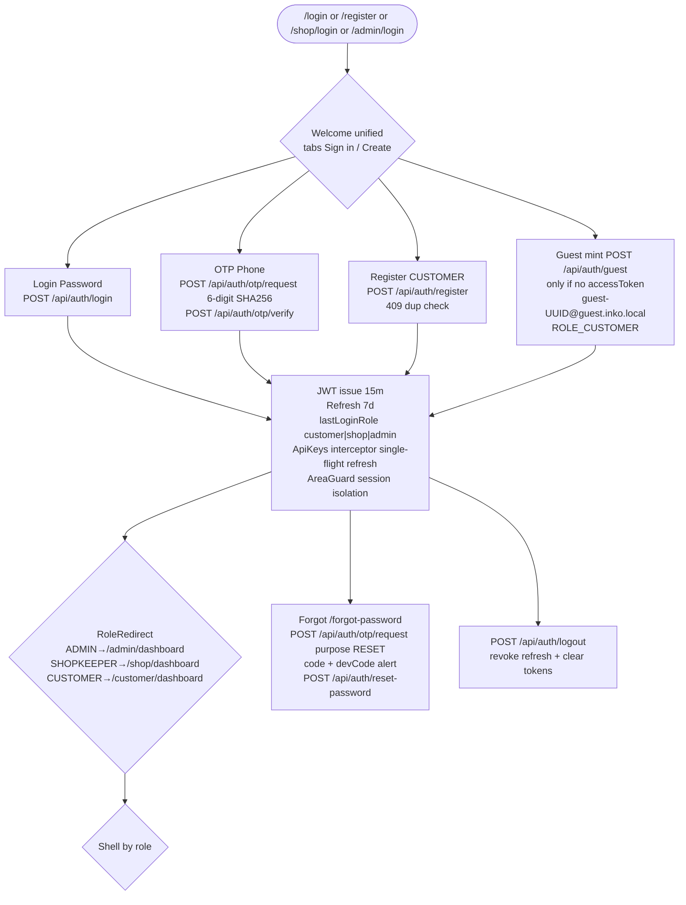

**OTP limits:** 5 attempts, 5m expiry, consumed flag, devCode returned if `devMode true`.

---

## 9. Pricing Deep Dive (PrintCalc Reusable)

```
Inputs: shopId, paperSize A4..LEGAL, colorMode BW/COLOR, sidesMode SINGLE/DOUBLE,
        selectedPageCount = PrintCalc.parsePageCount(pageSelection, doc.pageCount)
        copies 1-100, couponCode, specialPaper bool, userId
Process:
  rule = findResolved(shopId,paper,color,sides,today) or throw PRICING_NOT_CONFIGURED
  printedPages = pages * copies
  sheetsPerCopy = DOUBLE ? (pages+1)/2 : pages
  sheets = sheetsPerCopy * copies = physical sheets consumed
  subtotal = unitPrice * printedPages
  specialCharge = spc * sheets if specialPaper
  decompose baseline paperCharge + remainder 50/50 color/side
  discount = best active rule or coupon → amount
  after = chargeBase - discount
  tax = after * taxPercent/100 (system_settings tax.percent)
  final = after+tax ; if final < minOrderAmount => final = min ; tax = final-afterDiscount
Output: PriceBreakdown {unitPrice,pages,copies,sheets,printedPages,subtotal,paper,color,side,special,discount,ruleId,couponId,tax,taxPercent,final,currency,ruleId}
Frontend quote vs Order create: both use same PrintCalc; mismatch bug fixed (sum vs first doc)
```

---

## 10. Inventory & Low-Stock (Idempotent)

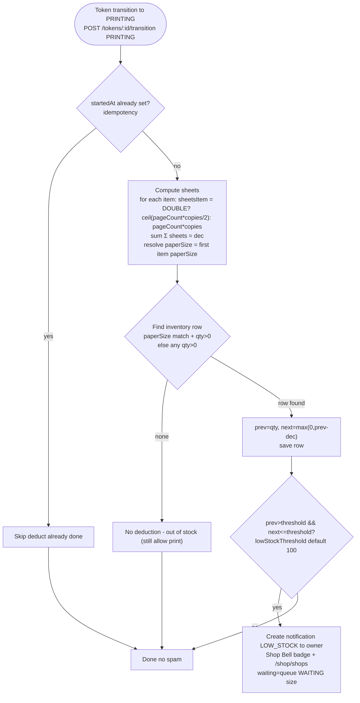

---

## 11. SSE + Polling Lifecycle (Customer & Shop)

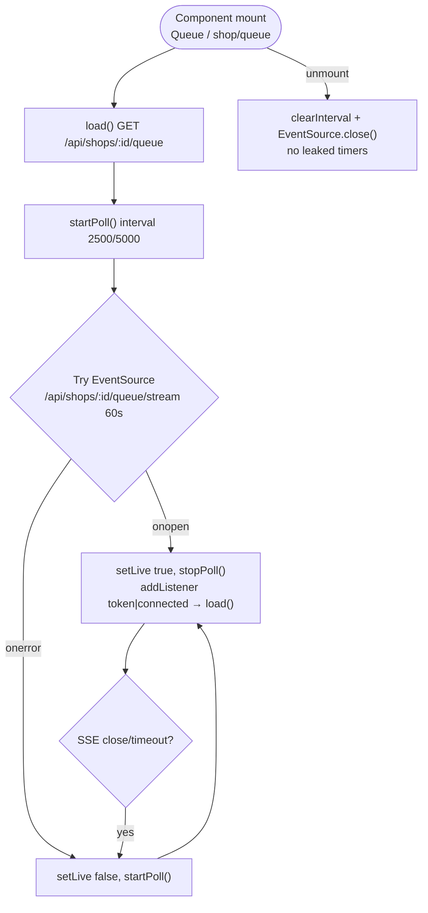

---

## 12. Error Branches — HTTP Quick Reference

| Area | Action | Error | UI |
|---|---|---|---|
| QR | resolve 404/EXPIRED/REPLACED | — | AlertTriangle + Continue without QR |
| Auth | register dup | 409 Already exists | Alert red + link Sign in |
| Auth | login wrong | 401 INVALID_CREDENTIALS | Alert |
| Auth | OTP 5 attempts | 429 TOO_MANY_REQUESTS | Alert limit |
| Pricing | no rule | 404 PRICING_NOT_CONFIGURED | Alert pricing not set |
| Order | shop null/closed | 400 ValidationFailed Shop not open | Alert Select shop |
| Payment | duplicate order | 200 return existing (idempotent) | Alert Already paid → token exists |
| Token | invalid transition WAITING→COMPLETED | 400 Invalid transition | Alert Already completed refreshing |
| Shop | patch without ownership | 403 You do not manage this shop | Alert |
| Admin | self suspend | 400 You cannot change … | Alert |
| Inventory | NFE/NaN | 400 Validation | Alert qty must be number |

---

## 13. Viewing & Export

- Paste each `mermaid` block into [mermaid.live](https://mermaid.live) → export PNG/SVG/PDF
- VS Code: install `Markdown Preview Mermaid Support` → `Ctrl+Shift+V` preview `func/FLOWCHART.md` → right-click Export
- GitHub: pushes auto-render flowchart TD natively
- Whole App + Guest + Customer + Shop + Admin + Sequence = 6 runnable diagrams; State diagrams = 3 more
- Keep `func/FLOWCHART.md` as source of truth; version bump on each migration V13+

---

## 14. Fix Diff Since Last Audit (2026-08-29)

- **Flow corrected:** Inventory now `sheets` not `printedPages*copies`; paperSize matched; threshold-cross dedup; idempotent `wasStarted` guard fixed (wasStarted before setStartedAt)
- **Token idempotent:** `findByOrderId` before generate; Payment verify `PAID` skip; init returns existing not CONFLICT; concurrent check-then-act still race without DB UNIQUE FOR UPDATE noted
- **QueueEntry standardized:** `PROCESSING→PRINTING`, `DONE→COMPLETED` alignment; DB still PROCESSING/DONE legacy vs standardized documented
- **Shop validation:** `POST /orders` validates `shopId !=null && shop OPEN else 400`
- **SSE:** Customer 2500 + shop 2500 with stop/start on live/fallback, cleanup on unmount; global CopyOnWriteArray leaks across shops noted

## 15. Not Covered / Legacy (Gaps Closed)

- **Orphan pages:** `Login.tsx` `Register.tsx` `CustomerLogin.tsx` legacy NOT routed — unified `Welcome.tsx` used, flagged dead code
- **Catalog prefix:** actual `PUT /api/shops/:shopId/inventory` + `DELETE .../:rowId` + `GET/POST/PATCH/DELETE /api/shops/:shopId/printers` (not `/api/catalog`)
- **QR paths:** actual `POST /api/qr/:id/regenerate` by qrId + `GET /api/shops/:shopId/qr` vs `GET .../qr/scans` enriched, `POST /api/shops/:shopId/qr` generate, `GET /api/admin/qr?shopId` null bug
- **Token SSE:** `GET /api/shops/:shopId/queue/stream` 60s global broadcast no shop filter leak + `GET /api/net/lan-ip` DatagramSocket 8.8.8.8
- **Payment:** `GET /api/orders/:id/refunds` + `POST /api/orders/:id/refund` optional amount reason 10% fee + `POST /api/refunds/:id/decision` case-insensitive APPROVE
- **Order direct COMPLETED:** `QUEUED→COMPLETED` valid skip PRINTING per canTransitionTo

