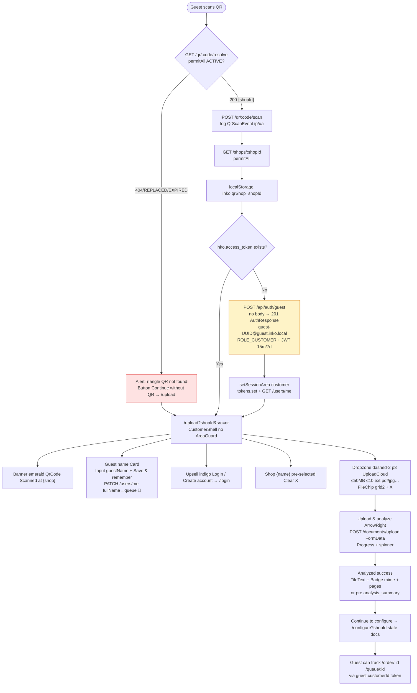
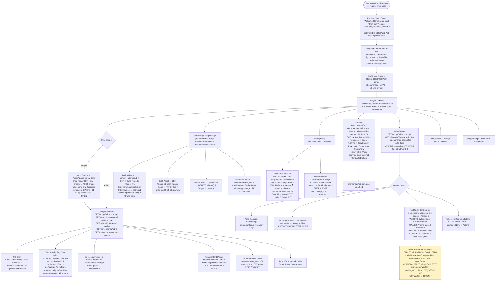
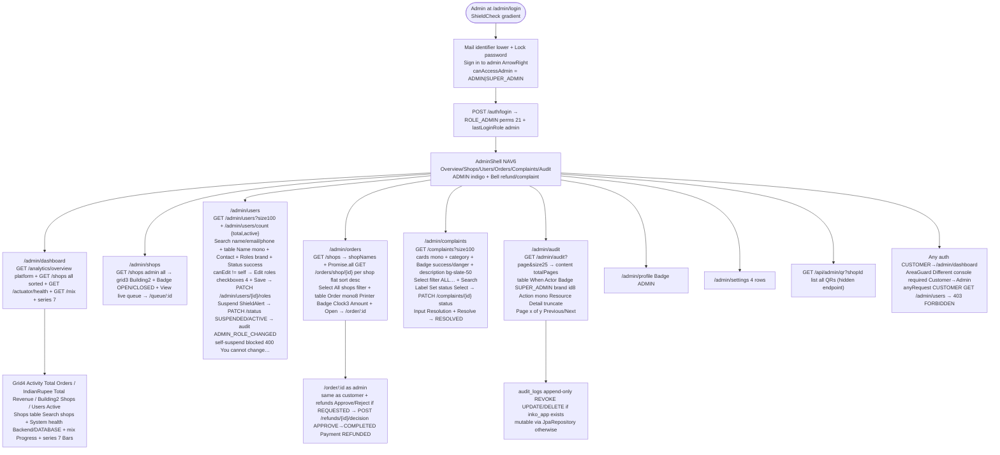
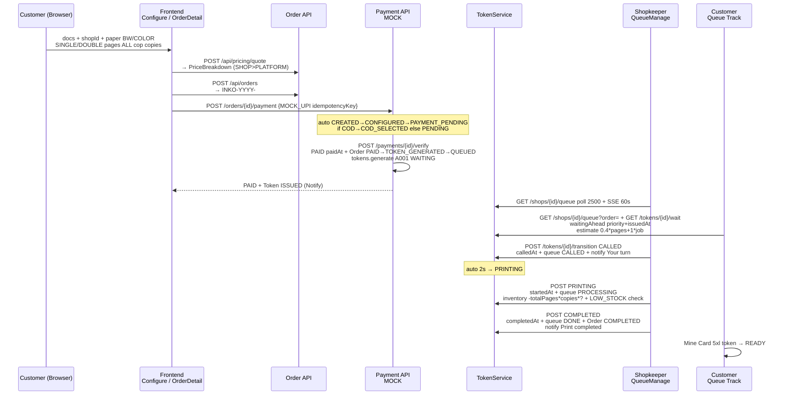

# Inko — Detailed Flow Charts — Per Actor + Whole App

**Date:** 2026-08-28 23:15 IST  
**Source:** `LOGICAL_AUDIT.md` + `FUNCTIONALITY.md` + Use Cases `func/USECASE_*.md`  
**Format:** Mermaid `flowchart TD` — copy into `mermaid.live` or GitHub preview. Separate file as requested.

---

## 1. Whole App — System Overview (All Actors + Services + DB)

```mermaid
flowchart TD
    %% Nodes
    Poster[("📮 QR Poster<br/>codeValue ACTIVE")]
    Browser["Browser<br/>http://localhost:5173"]
    Frontend["Frontend React<br/>App.tsx + AreaGuard<br/>Customer/Shop/Admin Shell"]
    AuthAPI["Auth API<br/>/api/auth/*<br/>JWT 15m / Refresh 7d"]
    ShopAPI["Shop API<br/>/api/shops*<br/>Catalog / QR"]
    DocAPI["Document API<br/>/api/documents/upload<br/>50MB / 10 files"]
    PricingAPI["Pricing API<br/>/api/pricing/quote<br/>SHOP > PLATFORM"]
    OrderAPI["Order API<br/>/api/orders<br/>INKO-YYYY-######"]
    PaymentAPI["Payment API<br/>/api/orders/{id}/payment<br/>MOCK_UPI / COD"]
    TokenAPI["Token API<br/>/api/tokens/*<br/>A001 priority"]
    QueueSSE["SSE<br/>/shops/{id}/queue/stream 60s"]
    AnalyticsAPI["Analytics API<br/>/analytics/overview|series|mix"]
    AdminAPI["Admin API<br/>/admin/users|audit<br/>/complaints /refunds"]
    NotifyAPI["Notification API<br/>/notifications"]
    DB[("PostgreSQL 17<br/>28 tables<br/>V1-V12 + seeds")]

    %% Edges — Whole flow
    Poster -->|scan /qr/:code| Browser
    Browser --> Frontend
    Frontend -->|GET /qr/:code/resolve<br/>POST /qr/:code/scan permitAll| ShopAPI
    Frontend -->|POST /auth/guest<br/>POST /auth/register|SHOP_OWNER<br/>POST /auth/login + OTP<br/>POST /auth/refresh single-flight| AuthAPI
    Frontend -->|POST /documents/upload FormData<br/>onUploadProgress| DocAPI
    Frontend -->|POST /pricing/quote<br/>shopId paper color sides pages copies| PricingAPI
    Frontend -->|POST /orders<br/>GET /orders /history<br/>GET /orders/shop/{id}| OrderAPI
    Frontend -->|POST /orders/{id}/payment<br/>POST /payments/{id}/verify| PaymentAPI
    PaymentAPI -->|PAID→tokens.generate A%03d| TokenAPI
    TokenAPI -->|WAITING→CALLED→PRINTING→COMPLETED<br/>QueueEntry WAITING→DONE| OrderAPI
    TokenAPI -->|decrement inventory -totalPages*copies<br/>LOW_STOCK notify owner| ShopAPI
    TokenAPI -->|TOKEN_CALLED/PREPRINT/COMPLETED notify| NotifyAPI
    Frontend -->|GET /shops/{id}/queue<br/>GET /tokens/{id}/wait<br/>EventSource SSE| QueueSSE
    Frontend -->|GET /analytics/overview?shopId<br/>GET /series?days| AnalyticsAPI
    Frontend -->|GET /admin/users|audit<br/>PATCH roles/status<br/>GET /complaints PATCH| AdminAPI
    Frontend -->|GET /notifications<br/>POST /read| NotifyAPI
    AuthAPI & ShopAPI & DocAPI & PricingAPI & OrderAPI & PaymentAPI & TokenAPI & AnalyticsAPI & AdminAPI & NotifyAPI --> DB

    %% Notes
    style Poster fill:#ede9fe,stroke:#7c3aed
    style Frontend fill:#dbeafe,stroke:#2563eb
    style DB fill:#fef3c7,stroke:#d97706
```

**Whole app sequence:**
`QR scan → Guest mint (ephemeral CUSTOMER) → Upload (analyze pages) → Configure (quote decompose → final) → Create Order INKO-YYYY → Payment MOCK_UPI verify PAID / COD → Token A001 WAITING → Shop Queue CALLED→PRINTING (decrement inventory)→COMPLETED → Customer Queue SSE live → History reprint → Shop Pricing/Inventory/QR → Admin Users/Orders/Complaints/Audit`

---

## 2. Guest via QR (Unauthenticated → Ephemeral CUSTOMER)



**Test path (browser explicit):** `http://localhost:5173/qr/TESTCODE → Network POST /auth/guest 201 → Application LocalStorage inko.access_token → DB guest-* → ShopPrint`

---

## 3. Customer (ROLE_CUSTOMER — Registered / Logged In)

```mermaid
flowchart TD
    CStart([Customer at /login<br/>Welcome unified]) --> Tabs{"Tabs Sign in / Create account<br/>Cards Customer FileText vs Shop Store"}
    Tabs -->|Create| RegCust["Register Customer<br/>User fullName 1-120<br/>Email @Email || Phone +?[0-9]{8,15} fullPhone<br/>Password 8-72 + confirm match<br/>strength bar len*12%"]
    RegCust --> POSTReg["POST /api/auth/register<br/>{fullName,email,phone,password,accountType CUSTOMER}<br/>409 if duplicate"] --> AuthRespCust["201 AuthResponse<br/>access 15m refresh 7d<br/>roles ROLE_CUSTOMER<br/>lastLoginRole customer"] --> DashCust
    Tabs -->|Sign in| Methods{"method Password / Phone OTP"}
    Methods -- Password --> LoginPwd["Mail identifier lower<br/>Lock password + Forgot? → /forgot-password<br/>Sign in ArrowRight"] --> POSTLogin["POST /auth/login<br/>findByEmailOrPhone + BCrypt requireActive<br/>lastLoginAt now"] --> AuthRespCust
    Methods -- OTP --> SendOTP["Country +91 + phone → Send OTP<br/>POST /auth/otp/request"] --> DevCode["200 delivered + devCode Alert info<br/>devMode + OtpIssue 6-digit SHA256 5m 5 attempts"] --> VerifyOTP["Input mono 6-digit → Verify<br/>POST /auth/otp/verify → AuthResponse"]
    VerifyOTP --> AuthRespCust
    AuthRespCust --> DashCust["/customer/dashboard<br/>AreaGuard customer + CustomerShell<br/>Hero Welcome back 👋<br/>Stats Shops online / Your orders<br/>Shops grid OPEN/BUSY Badge OPEN success"]
    
    DashCust --> UploadC["/upload<br/>Stepper Upload current0<br/>Dropzone → POST /documents/upload<br/>GET /documents list"] --> ConfigC["/configure?shopId<br/>Stepper Configure current1<br/>Select shop / QR locked emerald<br/>Options A4…legal BW/COLOR SINGLE/DOUBLE copies<br/>Pages ALL tip 1-5,8 + Tag coupon uppercase"]
    ConfigC --> Quote["POST /pricing/quote<br/>SHOP override PLATFORM<br/>decompose paper/color/side 50/50<br/>discount best + tax + minOrder<br/>→ YOU PAY ₹final"] --> CreateOrd["POST /api/orders<br/>items [{documentId paper color sides orientation AUTO pageSelection copies}]<br/>→ INKO-YYYY-###### CREATED + PrintConfiguration + OrderItem"]
    CreateOrd --> Detail["/order/:id poll 3s<br/>Receipt Badge + ₹ + Track queue Ticket<br/>Stepper PLACED→PAYMENT→QUEUED→PRINTING→COMPLETED<br/>Live Badge WAITING/Called/Printing/Completed + estimate"]
    Detail --> Pay{"Pay"}
    Pay -- MOCK_UPI --> Initiate["POST /orders/:id/payment {MOCK_UPI idempotencyKey}<br/>auto CREATED→CONFIGURED→PAYMENT_PENDING"] --> Verify["POST /payments/:id/verify<br/>PAID + paidAt + Order PAID→TOKEN_GENERATED→QUEUED<br/>tokens.generate A001 WAITING"] --> QueueC
    Pay -- COD --> CODP["POST payment {COD} → COD_SELECTED→QUEUED"] --> QueueC
    Detail --> RefundBtn["Request refund 10% fee Btn if PAID<br/>POST /orders/:id/refund → REQUESTED"] --> AdminDecideA["Admin POST /refunds/{id}/decision APPROVE→COMPLETED"]
    Detail --> Complaint["File complaint Dialog 9 categories<br/>POST /complaints OPEN"]
    
    QueueC["/queue/:shopId?order=<br/>Header Store Queue live SSE Radio/Emerald vs Polling amber<br/>Mine Card 5xl tokenNumber + Badge + Position<br/>Waiting list priority+issuedAt + At a glance"]
    QueueC --> HistoryC["/history<br/>GET /orders → Search + Status + Shop Select<br/>table Order mono8 Printer Badge Clock3 Amount<br/>Print again → /configure?reprint state docs"]
    HistoryC --> ProfileC["/customer/profile<br/>avatar 16x16 + Badge brand + dw Mail/Phone/ShopId<br/>Open settings + Sign out → POST /auth/logout → /login"]
    ProfileC --> Danger["DangerZone red Trash2 → Dialog password → DELETE /users/me → INACTIVE deleted-{id}"]
    ProfileC --> SettingsC["/customer/settings<br/>4 rows Bell/Volume2/Moon/Globe<br/>notifications sound darkMode language en-IN hi mr<br/>localStorage inko.settings + speech Test voice"]
    SettingsC --> BellC["NotificationsBell Bell h9 w9 badge red<br/>GET /notifications refetch30s + unread-count<br/>speak newest if sound"]
    
    %% Error branch
    LoginPwd -- 401 --> ErrLogin["401 INVALID_CREDENTIALS"]
    RegCust -- 409 --> ErrDup["409 Already exists"]
    Pay -- 409 --> ErrPay["409 Already paid"]
```



---

## 4. Shopkeeper (ROLE_SHOPKEEPER — Owner of shops.owner_user_id)



---

## 5. Admin / Super Admin (ROLE_ADMIN | SUPER_ADMIN — Governance)



---

## 6. Detailed Sequence — Order → Payment → Token → Queue (Cross-Actor Core)



---

## 7. Notes — How to View

- Paste each `mermaid` block into [mermaid.live](https://mermaid.live) or VS Code `Markdown Preview Mermaid` extension.
- Export PNG/PDF for docs/print.
- Whole App diagram shows **infra flaw** `PG 0xC0000142` infra (10 BLOCKED) vs code PASS separation — re-run after Docker PG fix flips BLOCKED→PASS.

